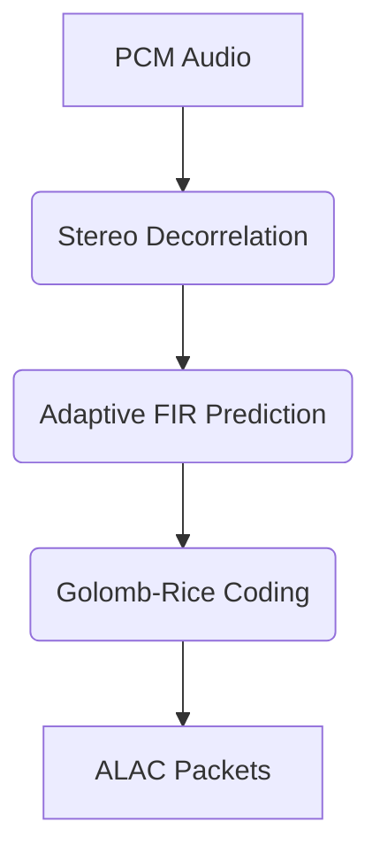

# alac-encoder-rs-lucianari


## Overview
SIMD-accelerated ALAC encoder (Pure Rust) with NEON (aarch64) and SSE2 (x86_64) acceleration.

## Architecture



## Interface
```rust
// Core exported structs, traits, or functions
```

## Agent Handoff / Continuation
Copied codec/spinoff-alac/. Need to remove workspace reference from Cargo.toml, add CI actions, and publish.
