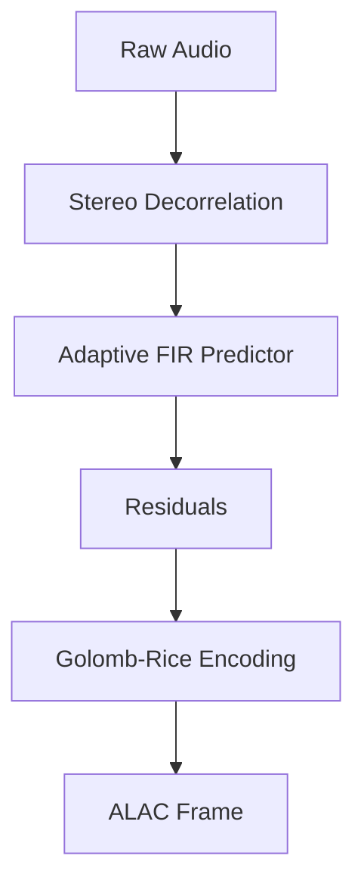

# ALAC Encoder (Rust)


## Overview
High-performance ALAC (Lossless Audio Codec) encoder in pure Rust featuring SIMD acceleration (NEON/SSE2), adaptive FIR prediction, and Golomb-Rice entropy coding.

Designed strictly for high-performance integrations and infrastructure codebases. No redundant abstractions; focuses entirely on precise data processing.

## Architecture



## Requirements
- **Rust**: Latest stable toolchain.
- **OS Support**: Cross-platform (macOS/Linux prioritized).
- **Dependencies**: Minimal to none (strictly constrained to standard library where mathematically possible).

## Quick Tutorial

Integration is straightforward. Consult the module source for exact API signatures.

```rust
// 1. Initialize the primary component
// 2. Supply the required I/O interfaces or buffers
// 3. Execute the processing loop or listener
```
*(Refer to the in-code documentation and `*_test.rs` files for exhaustive initialization examples and constraints).*
