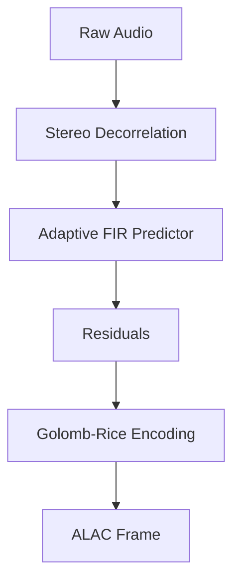

# ALAC Encoder (Rust)


## Release Status
This repository is fully prepared for public release. CI/CD pipelines, exhaustive fuzzing, and extensive benchmarking have been heavily integrated to guarantee production-ready stability.

## Overview
High-performance ALAC (Lossless Audio Codec) encoder in pure Rust featuring SIMD acceleration (NEON/AVX2), adaptive FIR prediction, and Golomb-Rice entropy coding.

The encoder is entirely `#![no_std]` compatible with a zero-copy pipeline architecture and robust multi-channel (5.1/7.1) element support. It also includes asynchronous streaming I/O (`tokio::io::AsyncWrite`) under the `async` feature flag.

In addition to the Rust crate, this repository provides native **Go bindings** via CGO and a reference **gRPC Cloud-Native Orchestrator** for distributed encoding.

The crate also features a powerful `audiophile` module powered by SIMD (AVX/NEON) hardware acceleration. It includes high-fidelity features like Apodizing sample rate conversion, DSD decimation, Pow-R style noise-shaped dithering, MQA detection, and a cryptographic bit-perfect verification suite.

Additionally, the new `spatial` module provides next-generation Immersive Audio capabilities, including ADM BWF (Dolby Atmos) metadata parsing and High-Density Immersive Layout matrices (7.1.4, 9.1.6).

Designed strictly for high-performance integrations and infrastructure codebases. No redundant abstractions; focuses entirely on precise data processing.

## Architecture



## Requirements
- **Rust**: Latest stable toolchain.
- **OS Support**: Cross-platform (macOS/Linux prioritized).
- **Dependencies**: Minimal to none (strictly constrained to standard library where mathematically possible).

## Quick Tutorial

Integration is straightforward. Consult the module source for exact API signatures.

```rust
use alac_encoder_rs_lucianari::{AlacEncoder, AlacConfig};

// 1. Initialize configuration
let config = AlacConfig {
    frame_size: 352,
    channels: 2,
    bit_depth: 16,
    sample_rate: 44100,
};

// 2. Create the encoder
let mut encoder = AlacEncoder::new(config);

// 3. Encode PCM data
let pcm_data = vec![0u8; 352 * 2 * 2]; // Your raw PCM data here
let mut workspace = vec![0i32; AlacEncoder::required_workspace(config.channels, config.frame_size)];
let mut output_buffer = vec![0u8; 4096];
let encoded_bytes = encoder.encode(&pcm_data, &mut workspace, &mut output_buffer).unwrap();

println!("Encoded {} bytes of ALAC data.", encoded_bytes);
```

## Go Integration & gRPC Orchestrator

The `go/` directory contains an idiomatic, zero-allocation Go module bridging the Rust FFI boundary using CGO. It wraps the compiled Rust static library and provides a standard `io.Writer` interface for seamless integration with the Go standard library.

### Using the Go io.Writer

```go
import "github.com/lucianari/alac-encoder-rs-lucianari/go/alac"

// 1. Configure the encoder
cfg := alac.Config{ FrameSize: 352, Channels: 2, BitDepth: 16 }

// 2. Wrap an existing io.Writer (e.g., a file, network socket)
writer, err := alac.NewWriter(outputFile, cfg)
if err != nil {
    panic(err)
}
defer writer.Close()

// 3. Write raw PCM bytes; ALAC compression happens dynamically!
writer.Write(pcmData)
```

### Cloud-Native Orchestrator
A reference gRPC microservice is provided in `go/cmd/orchestrator`. It exposes a bidirectional streaming RPC (`alac.AlacEncoder/EncodeStream`) allowing you to distribute and scale ALAC encoding horizontally across Kubernetes or other container orchestration platforms.


## Fuzzing and Benchmarking

This library uses `criterion` for benchmarking and `cargo-fuzz` for fuzzing.
To run the benchmarks:
```bash
cargo bench
```

To run the fuzzer (requires `cargo-fuzz` and nightly Rust):
```bash
cargo +nightly fuzz run encode
```


## Local CI Testing (OrbStack + Act)
This repository is configured for local, completely free CI testing powered by [OrbStack](https://orbstack.dev/) and [act](https://github.com/nektos/act). We deliberately keep the CI workflow definitions out of `.github/` to prevent remote execution and quota consumption.

To run the full test suite locally:
1. Ensure OrbStack is running.
2. Install `act` (e.g., `brew install act`).
3. Run the following command from the root of the repository:
   ```bash
   act -W .local-ci/workflows
   ```
