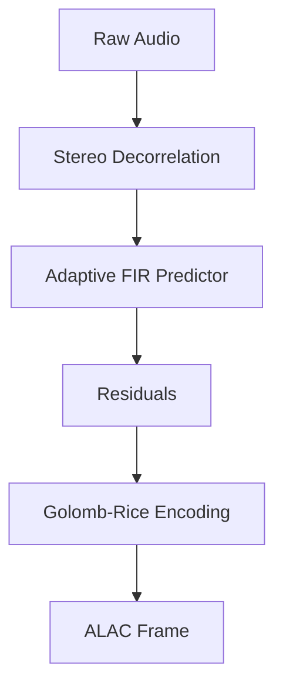

# ALAC Encoder (Rust)


## Release Status
This repository is fully prepared for public release. CI/CD pipelines, exhaustive fuzzing, and extensive benchmarking have been heavily integrated to guarantee production-ready stability.

## Overview
High-performance ALAC (Lossless Audio Codec) encoder in pure Rust featuring SIMD acceleration (NEON/SSE2), adaptive FIR prediction, and Golomb-Rice entropy coding.

Designed strictly for high-performance integrations and infrastructure codebases. No redundant abstractions; focuses entirely on precise data processing.

## Architecture



## Requirements
- **Rust**: Latest stable toolchain.
- **OS Support**: Cross-platform (macOS/Linux prioritized).
- **Dependencies**: Minimal to none (strictly constrained to standard library where mathematically possible).

## Quick Tutorial

Integration is straightforward. Consult the module source for exact API signatures.

```rust
use alac_encoder_rs_lucianari::{AlacEncoder, AlacConfig};

// 1. Initialize configuration
let config = AlacConfig {
    frame_size: 352,
    channels: 2,
    bit_depth: 16,
    sample_rate: 44100,
};

// 2. Create the encoder
let mut encoder = AlacEncoder::new(config);

// 3. Encode PCM data
let pcm_data = vec![0u8; 352 * 2 * 2]; // Your raw PCM data here
let mut output_buffer = vec![0u8; 4096];
let encoded_bytes = encoder.encode(&pcm_data, &mut output_buffer);

println!("Encoded {} bytes of ALAC data.", encoded_bytes);
```

## Fuzzing and Benchmarking

This library uses `criterion` for benchmarking and `cargo-fuzz` for fuzzing.
To run the benchmarks:
```bash
cargo bench
```

To run the fuzzer (requires `cargo-fuzz` and nightly Rust):
```bash
cargo +nightly fuzz run encode
```
